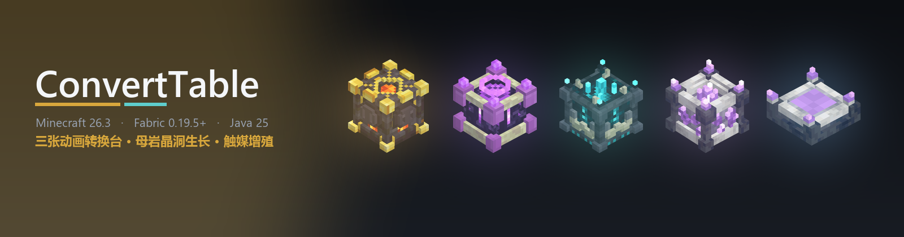
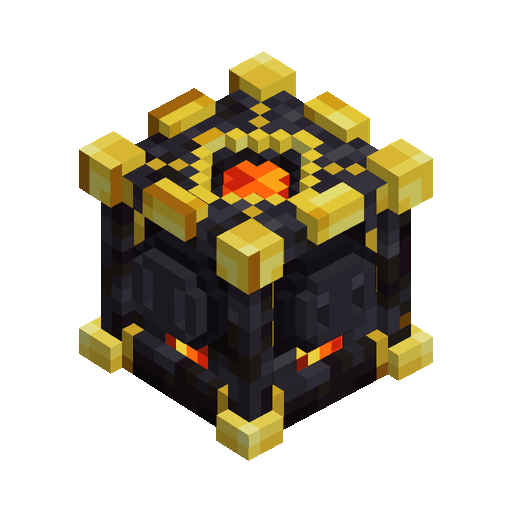
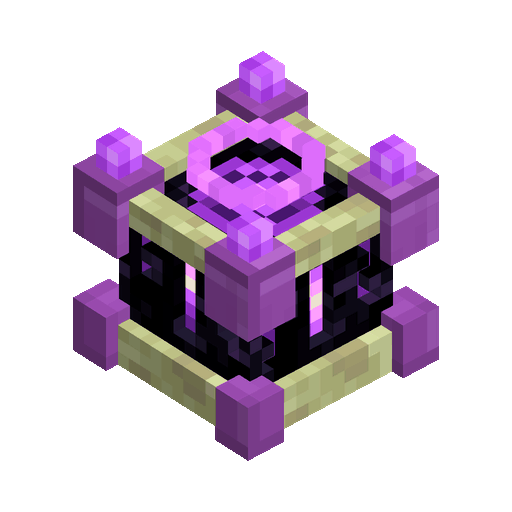
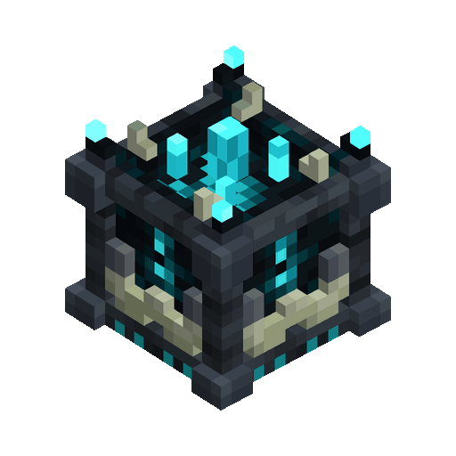
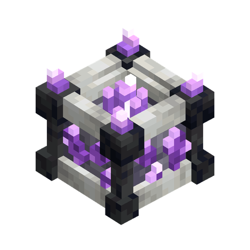
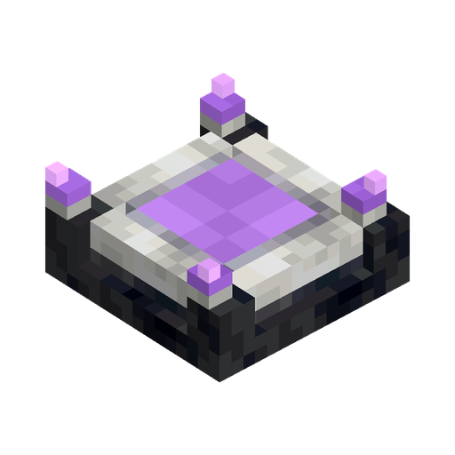

  

<h1 align="center">ConvertTable</h1>

<a href="README.md">中文</a> · <b>English</b>

Turn building materials into the styles you need, or produce blocks continuously with an amethyst network.

Version **v0.2.0** supports **Minecraft Java 26.3 / Fabric**. All five blocks can be crafted at a crafting table or found in the **Functional Blocks** creative tab.

## Install

Download the mod JAR for 26.3 from [Releases](https://github.com/GYPp1us/ConvertTable/releases/latest). Put it in `mods` with [Fabric API](https://modrinth.com/mod/fabric-api). Use Fabric Loader 0.19.5 or newer and Java 25. Install the same mod version on both sides for multiplayer. Do not install the `-sources` file.

## Choose a block

| Black Gold Conversion Table | End Conversion Table | Sculk Conversion Table |
| :---: | :---: | :---: |
|  |  |  |
| Spend gold nuggets for a random different material in the same group | Spend chorus fruit charge to choose the output | Ordinary batches spend 1 available soul; advanced recipes use their listed soul cost |

| Budding Crystal Table | Catalyst Pedestal |
| :---: | :---: |
|  |  |
| Export growth factors from connected amethyst buds | Produce a selected block using factors; keep the catalyst |

## Black gold: random conversion

1. Right-click the table. Put material in the **input slot** and gold nuggets in the **fuel slot**.
2. Click **Start batch** and collect the output.
3. Turn **Auto** on for repeated batches. The table starts each next eligible batch automatically and keeps running after you close the screen.

Black gold has no target selector. Oak planks, for example, become a random different kind of plank from their group. A Connection Rod can also set linked input and output containers. Ordinary black gold conversions are **1:1**, and never select the input itself.

The default cost is **1 gold nugget per batch**. Recipes set the batch limit; partial batches still pay once. Materials and costs are charged when the result is delivered. If output is blocked at completion, the screen stays at completed progress until space is available, then delivers the result.

## End: choose the output

1. Put material in the **input slot** and **chorus fruit** in the fuel slot.
2. Find and click the target on the right.
3. Click **Start batch** or turn **Auto** on. Once enabled, material in the device slot or linked input containers starts the next eligible batch automatically, without another click.

End supports all ordinary black gold groups and additional groups. Ordinary conversions remain **1:1**. By default, each chorus fruit supplies **16 phase charge**, and each batch costs **1 charge**. Costs are paid only when a conversion succeeds. On the sculk table, these ordinary groups cost **1 available soul per batch**.

### Link containers and process shulker boxes

End and sculk offer three input modes:

| Mode | How to use it | Where the output goes |
| :--- | :--- | :--- |
| **Device slots** | Insert material and select a target | The table's output slot, or a linked output container |
| **Connected containers** | Link input and output containers with a Connection Rod, then select a target | Takes material from input containers and sends products to output containers |
| **Shulker contents** | Put one shulker box in the input slot and select a target | Replaces contents inside the box; retrieve it manually |

Containers are not scanned automatically. With a Connection Rod, pair a conversion table and container for the input role with left-clicks, or the output role with right-clicks; click order does not matter. Input links glow green and output links amber. Each endpoint must be within **16 blocks** by combined distance along the three axes; each table supports up to **8 input and output links combined**. A container cannot have both roles. The clicked face controls sided-container access; a double chest counts as one.

Repeat a link to remove it. Sneak-click the table with the rod to clear that role; clearing all input links returns the table to device-slot mode. Craft the rod shapelessly from one stick. Catalyst pedestals support output links only.

- **Exact matching**: connected containers use the input item as a sample without consuming it. Shulker contents lock onto the first successfully converted material. Reselect the target or change the input or matching mode to reset the lock.
- **Group matching**: process every material that has a recipe for the selected target.

Shulker boxes retain their names and untouched contents. Boxes inside boxes are not opened recursively. An inaccessible input container blocks transfers. Ordinary batches can shrink to fit remaining output space. Conversion operations take a fixed **4 seconds** on Black Gold, **2 seconds** on End, and **1 second** on Sculk. The table screen shows an animated progress bar. If output is blocked when work completes, progress stays complete until space is available and the result can be delivered.

## Sculk: collect available souls for conversions

Each ordinary batch costs **1 available soul** and no phase. Advanced recipes spend the soul amount listed for that recipe. Insert the required main material and any specified **catalyst material**, select the output, and convert. Catalyst materials are consumed. Empty buckets and other remainders go to the **remainder slot**. Some recipes need no catalyst or remainder; recipes with an outcome pool choose one listed result at equal odds.

Advanced conversions spend the **available souls** shown by the table, without phase charge or player experience. **Manual only** recipes require the device input slot and a button click. They cannot run continuously or process container contents. On upgraded worlds, old phase fuel in the sculk table's fuel slot drops to the ground.

### Collect available souls

Connect the table to the death area using sculk blocks or connected sculk veins. Mobs must die while standing on an **unobstructed sculk block top connected to the table**.

- An eligible mob's death adds souls based on its normal XP reward: **1 XP = 32 available souls**, up to **4096** stored per table. Player kills are not required by default. Mobs that do not drop XP, including baby animals that do not drop XP, add **0 souls**.
- Players, armor stands, and deaths in midair do not charge the table. The death area must be inside its sculk network, up to **16 blocks away** by combined axis distance. Networks contain up to **1024 sculk positions** and only count loaded areas.
- XP orbs, loot drops, and vanilla sculk-catalyst behavior are left alone. If a server is configured to require player kills, only player-caused eligible deaths count.
- When several tables share a network, each death belongs only to the nearest table by connected path.
- Disconnecting the ground, saving, or unloading chunks preserves stored souls. Breaking a table drops its inventory but does not transfer its available souls into the dropped block.

The **Range** tab in the sculk table screen shows a top-down X–Z network map. Each cell represents a horizontal position and merges all connected heights. Lighter cells mark sculk surfaces that can collect souls; darker cells mark other connected nodes; yellow marks the table. Unloaded chunks or scan limits are shown as an incomplete range.

## Crystal table and catalyst pedestal: continuous production

### 1. Build the network

Connect **budding amethyst** to the crystal table with **amethyst blocks**, touching face to face. Leave room for buds to grow on the budding amethyst. The buds export growth factors for the whole network.

Use **one crystal table per network**, with at most **8 budding amethyst blocks**. Conductors and budding amethyst must be within **8 blocks** of the table by combined axis distance. The entire network is limited to **128 positions, including the table**. Only loaded areas are processed. Exceeding the limits or connecting a second crystal table stops production.

### 2. Attach the pedestal and insert a catalyst

Place a **catalyst pedestal** directly beside the crystal table, an amethyst block, or budding amethyst. Open it, insert a supported ordinary catalyst, select the output, and click **Start growth**. Click **Pause growth** to stop. A catalyst may have several targets, so select the intended output in the screen. The pedestal displays the live production rate as growth proceeds.

For example, an **oak sapling** can catalyze oak logs, oak saplings, or oak leaves; mangrove uses a propagule. Nether stems and plants use their matching fungi, and bamboo uses bamboo as its catalyst. Growth targets include basic logs, saplings, leaves, soil and stone, common flowers, and plants; stripped logs, planks, sandstone, glass, and other processed forms are excluded. Saplings, fungi, and magical catalysts such as amethyst shards, echo shards, hearts of the sea, and ender pearls are reusable, and no tools are required.

The catalyst is **never consumed**. Renamed, enchanted, or otherwise customized items cannot serve as catalysts. Multiple pedestals share the network's factors. The screen shows the current production rate and progress toward the next item. The rate is the growth-factor rate currently allocated to that pedestal divided by the selected item's factor cost, so it can be fractional. Pausing keeps partial progress; changing the target clears the current partial progress. Completed output stays.

### 3. Collect output

Output first enters the pedestal's **9 output slots**, then moves into containers linked with a Connection Rod. Check the link indicators to confirm that a chest can accept the selected item. Without an output link, or when all slots and linked containers are full, output remains in the pedestal.

### 4. Increase production

- Each immature bud exports up to **1 growth factor per second** by default.
- Place **calcite** against any connected budding amethyst or amethyst conductor to raise the export limit to **2 factors per second** for immature buds throughout the network.
- Similarly placed **smooth basalt** increases the buds' internal growth factors. The crystal table screen shows stored factors separately from the current production rate.
- Mature clusters export no growth factors. In a usable network with at least one valid running pedestal, mature clusters are reseeded into small buds.

Holding a pedestal, calcite, or smooth basalt while aiming at a usable network position displays a placement hint beside the crosshair.

## Hopper automation

| Block | Insert | Extract |
| :--- | :--- | :--- |
| Conversion table | Material from above; fuel or sculk catalyst materials from the sides | Output and remainders from below |
| Catalyst pedestal | One valid catalyst from above | Output from the sides or below; linked output containers receive production |

Turn **Auto** on for conversion tables or click **Start growth** on pedestals. With Auto on, a table starts each eligible job automatically when its input and costs are ready, including material in linked input containers. Missing resources pause work. If output is blocked, the job still progresses to completion and waits there until delivery is possible; materials and costs are charged on delivery. Ordinary batches can shrink to fit free output space. The sculk table's side accepts catalyst materials only, so supply only what the recipe needs.

## Crafting

Each recipe produces **1 item**. `·` means an empty slot.

| Block | Pattern | Ingredients |
| :--- | :--- | :--- |
| Black Gold Conversion Table | `GTG` `BAB` `BCB` | G Gold ingot · T Snout armor trim smithing template · B Polished blackstone · A Amethyst shard · C Chiseled polished blackstone |
| End Conversion Table | `PHP` `OAO` `PEP` | P Purpur block · H Dragon head · O Obsidian · A Amethyst shard · E End stone |
| Sculk Conversion Table | `DKD` `SCS` `DED` | D Polished deepslate · K Sculk shrieker · S Sculk · C Sculk catalyst · E Echo shard |
| Budding Crystal Table | `CAC` `BXB` `CSC` | C Calcite · A Amethyst block · B Budding amethyst · X End crystal · S Smooth basalt |
| Catalyst Pedestal | `···` `CAC` `SSS` | C Calcite · A Amethyst block · S Smooth basalt |
| Connection Rod | Shapeless | Stick × 1 |

**Collecting budding amethyst:** mine it with a **Silk Touch** pickaxe to obtain the block. Explosions still destroy it.

## Recipes and troubleshooting

The complete default [recipe workbook](outputs/01a0f354-50a1-7850-9a3e-c4f75b90728b/ConvertTable配方.xlsx) contains **107 ordinary groups, 83 advanced sculk recipes, 105 growth recipes using 19 catalysts**, and six crafting recipes. The workbook's item names are in Chinese.

Some Farmer's Delight conversion groups and the seed-draw advanced recipe require Farmer's Delight to be installed. The workbook still lists these optional-mod recipes.

Optionally install **JEI or REI** for 26.3 to browse conversion recipes and uses. JEI also shows the crystal table and catalyst pedestal growth recipes. View growth targets in the pedestal screen or workbook. Servers can change conversion recipes; the in-game catalogue determines the available materials and costs.

**New recipes are missing after an update:** install the same new mod version on both the client and server. Unchanged 0.1.1 (formerly 1.5.2) default recipes are backed up and updated automatically; customized recipes are preserved, so the server administrator must add the new recipes and restart. In JEI, press **U** over a catalyst or workstation item, or **R** over an output, to find growth recipes.

**Conversion does nothing:** read the screen's status and check the target, material, fuel, catalyst material, available souls, and space in output and remainder slots. Use device slots for manual-only recipes.

**No growth output:** check that Growth is enabled, the catalyst is valid, a target is selected, and the network has connected budding amethyst with buds. Check network limits and remove any second crystal table. Finally, clear full output slots or containers linked with the Connection Rod.
