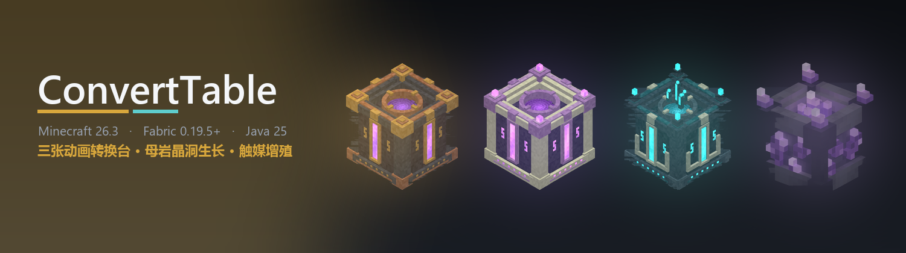
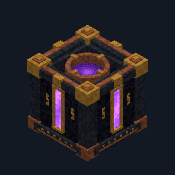
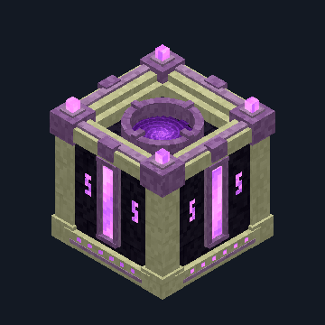
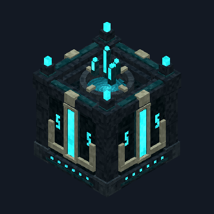
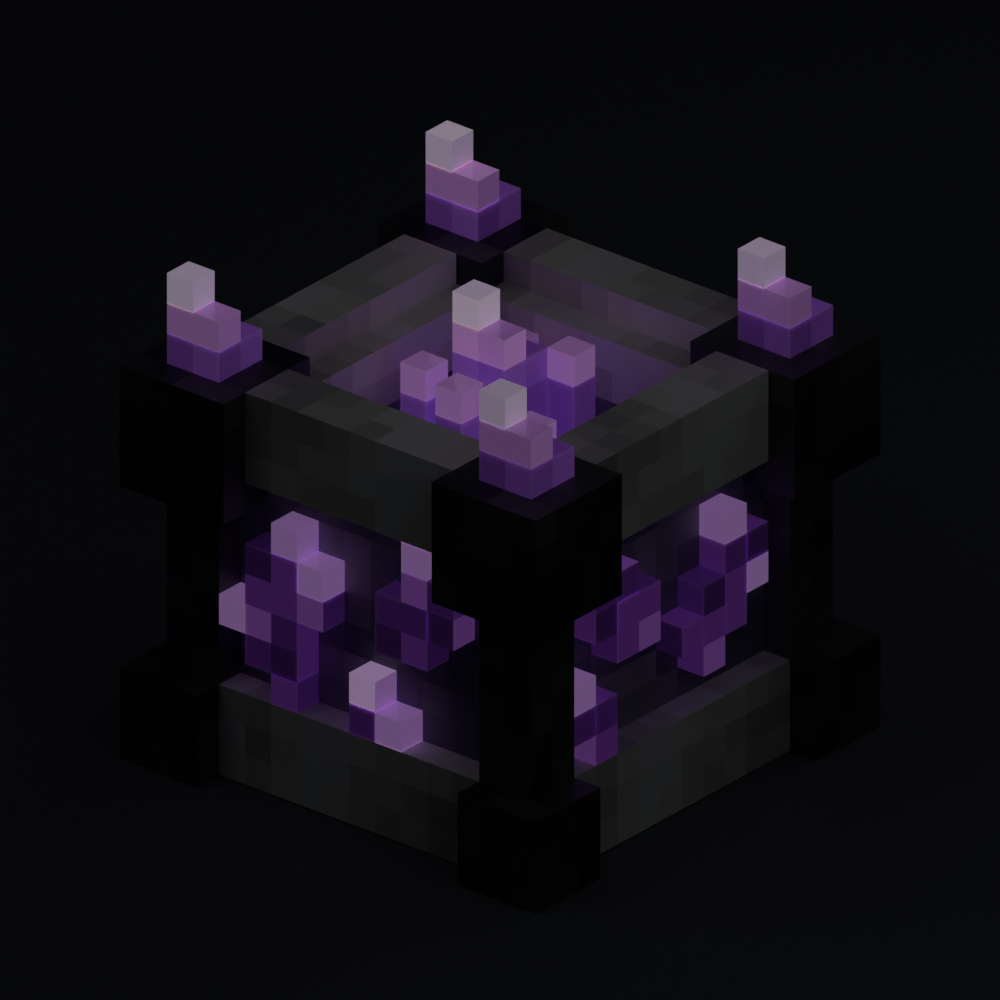

<div align="center">
  
</div>

<h1 align="center">ConvertTable</h1>

<p align="center">
  <b>中文</b> · <a href="README.en.md">English</a>
</p>

<p align="center">
  三张会动的转换台，加一座从母岩里长出来的晶体工厂。<br>
  把一堆没用的东西倒进去，换出你真正想要的那一样。
</p>

---

## 目录

- [这是什么](#这是什么)
- [安装](#安装)
- [转换台](#转换台)
- [母岩增殖台与触媒基座](#母岩增殖台与触媒基座)
- [合成表](#合成表)
- [配置配方](#配置配方)
- [常见问题](#常见问题)

---

## 这是什么

五种方块，两套玩法。

**转换台**负责「变废为宝」：把你塞进去的材料成批转换成想要的产物。猪灵台随机给惊喜，末地台用紫颂果当燃料精准定向，幽匿台则能花掉储存的生物死亡计数做进阶反应。

**母岩增殖台**负责「凭空生长」：把紫水晶母岩接进晶脉，它自己会攒生长势。再挂上触媒基座、放一块触媒、选一个目标——之后它就源源不断地把生长势变成实实在在的方块，自己流进旁边的箱子里。

| 方块 | 一句话 |
| :--- | :--- |
| 黑金转换台 | 猪灵风格，随机产出，金粒当耗材 |
| 末地转换台 | 末地风格，自选目标，紫颂果作相位燃料 |
| 幽匿转换台 | 幽匿风格，进阶配方，消耗生物死亡计数 |
| 母岩增殖台 | 晶洞产出生长势，供整条晶脉使用 |
| 触媒基座 | 消耗生长势复制方块，触媒永不消耗 |

---

## 安装

需要 **Minecraft Java 26.3** + **Fabric**，Java **25**。

| 组件 | 版本 |
| :--- | :--- |
| Minecraft | 26.3 |
| Fabric Loader | 0.19.5 或更高 |
| Fabric API | 0.161.0+26.3 或更高 |
| Java | 25 |

1. 从 [Releases](https://github.com/GYPp1us/ConvertTable/releases/latest) 下载 `convert-table-x.y.z.jar`。
2. 和 [Fabric API](https://modrinth.com/mod/fabric-api) 一起丢进 `mods` 文件夹。
3. **联机时客户端和服务端都要装**，两边版本必须一致。
4. 只放一个版本。带 `-sources` 的是开发用的，别装。

五种方块都在**功能方块**分类里：

```mcfunction
/give @s convert_table:black_gold_conversion_table
/give @s convert_table:end_conversion_table
/give @s convert_table:sculk_conversion_table
/give @s convert_table:crystal_table
/give @s convert_table:catalyst_pedestal
```

它们都占一格，放置时朝向玩家，发光等级 6，用镐挖掘掉落自身，活塞推不动。

---

## 转换台

右击打开界面：左边放材料，右边选目标，然后点**转换一批**。嫌一次次点麻烦就打开**连续**开关——默认是关的。

<div align="center">

| 黑金 | 末地 | 幽匿 |
| :---: | :---: | :---: |
|  |  |  |

</div>

### 三种输入模式

| 模式 | 做什么 |
| :--- | :--- |
| **投入槽** | 材料从输入槽消耗，产物进输出槽。最直观的用法。 |
| **连接容器** | 直接转换贴着转换台的容器里的东西，原位替换。 |
| **容器内容** | 把潜影盒放进输入槽，改的是盒子里的内容，盒子本身留着。 |

后两种模式还分**精确匹配**和**同组匹配**。精确模式把输入槽的物品当样本，不消耗它；同组模式接受所有能变成该目标的材料。

### 三台各有什么不同

**黑金转换台** —— 材料加金粒，产出一个同组里的**随机**其它物品。每批只收一次费用，不满一批也照收。产物堵住时，已经抽好的随机结果会一直保留，存档重进也不变。没有目标选择器，也没有进度条。

**末地转换台** —— 自己选目标。紫颂果提供相位储量，默认每颗补 16 点，**只有成功转换才扣**，闲置不掉。连续模式每 10 游戏刻（0.5 秒）尝试一批，界面关着也照转。

**幽匿转换台** —— 除了普通转换，还能做进阶配方。进阶配方会用到催化槽和返还槽，消耗相位储量和**储存的生物死亡计数**。标了 `auto: false` 的配方必须手动点击，不会自动跑。

所有费用在动手之前就全部检查完。不够就一点都不扣。

### 幽匿充能

生物**踩着暴露的幽匿方块**死亡时，会给最近的一张幽匿转换台记 1 点。玩家、盔甲架和在空中死的都不算。默认上限 4096 点。

一条晶脉连接多张台子时不会重复计数。断开表面也不清空已有的储量。

---

## 母岩增殖台与触媒基座

1.5 加入的第二套玩法，跟转换台完全独立。

<div align="center">
  
</div>

### 第一步：接一条晶脉

用**紫水晶方块**把**紫水晶母岩**连到母岩增殖台上。晶脉上的晶芽就是发电机组：

- 每个未成熟晶芽最多导出 **1 点/秒**，周围有**方解石**时翻倍到 **2 点/秒**。
- 每个晶芽的内部生长势是 **24 / 16 / 8 / 0**（对应小芽 / 中芽 / 大芽 / 晶簇），旁边有**平滑玄武岩**时 +1。
- 晶簇不再产出生长势。生产运行时，成熟晶簇可能被重新播种成小晶芽。

搜索范围是半径 16、最多 1024 个节点，只算已加载的区块。

### 第二步：挂上触媒基座

把**触媒基座**贴着任意晶脉导体或增殖台放置。放一块**触媒**进去，选一个目标产物，点开始。

- **触媒永远不会消耗**，放一次用到底。
- 选中的方块会以完整方块大小悬浮在触媒上方旋转。
- 多个基座会**公平分享**同一条晶脉的产出额度。
- 换目标会暂停生产并清空没花完的余势，但已经产出的东西留着。

### 第三步：接上箱子

基座有 **9 个输出槽**，会自动把产物灌进相邻的容器。双箱算一个，各方向的插入规则都遵守原版逻辑。

### 界面里能看什么

**增殖台界面**显示各阶段晶芽的数量柱状图，以及内在势、导出势、已用势三个分开的数值。

**基座界面**有分页的目标图标、上一轮产量、吸收的生长势、小数余势、缓冲区占用，还有六个方向的容器连接状态。

拿触媒基座、方解石或平滑玄武岩对着可用的晶脉导体时，准星旁边会出现一个**扁平像素图标**（基座 / 双向导出箭头 / 生长箭头），告诉你这个位置能不能用。

### 配方规模

内置 **53 个触媒组**、**225 个产物**。橡树树苗能解锁橡木原木、去皮原木、木头和木板等等。

---

## 合成表

每张配方产出一个方块。

### 转换台

| 方块 | 图案 | 材料 |
| :--- | :--- | :--- |
| 黑金转换台 | `GTG`<br>`BAB`<br>`BCB` | G 金锭 · T **猪鼻盔甲纹饰锻造模板** · B 磨制黑石 · A 紫水晶碎片 · C 錾制磨制黑石 |
| 末地转换台 | `PHP`<br>`OAO`<br>`PEP` | P 紫珀块 · H **龙首** · E 末地石 · O 黑曜石 · A 紫水晶碎片 |
| 幽匿转换台 | `DKD`<br>`SCS`<br>`DED` | D 磨制深板岩 · K **幽匿尖啸体** · S 幽匿块 · C **幽匿催发体** · E 回响碎片 |

### 增殖方块

| 方块 | 图案 | 材料 |
| :--- | :--- | :--- |
| 母岩增殖台 | `CAC`<br>`BXB`<br>`CSC` | C 方解石 · A 紫水晶块 · B 紫水晶母岩 · X **末地水晶** · S 平滑玄武岩 |
| 触媒基座 | `···`<br>`CAC`<br>`SSS` | C 方解石 · A 紫水晶块 · S 平滑玄武岩 |

> **紫水晶母岩现在可以采下来了。** 本模组覆盖了原版战利品表：用**精准采集**镐挖掘紫水晶母岩即可获得本体（原版只会白挖一场）。爆炸仍然会摧毁它。这样增殖台才真正可合成、可搬迁。

---

## 配置配方

服务器首次启动时会在 `config/convert_table/recipes.json` 生成一份默认配置。**改完要重启世界或服务器。**

- 默认包含 **99 个转换组 / 52 个进阶配方**。
- 你的修改会被保留，并同步给客户端。
- 只想当图鉴、不许实际转换？把 `execution_enabled` 设成 `false`。
- 详细字段说明见 [`config/convert_table/README.md`](config/convert_table/README.md)。
- 增殖配方在 `src/main/resources/data/convert_table/growth_recipes.json`，两端加载同一份有序目录。

**JEI / REI** 是可选适配：装了就能查输入、输出、费用、返还和用途，但**不会**帮你自动搬运物品。26.3 专用的 JEI / REI 构建需要单独安装。

---

## 常见问题

**装了没反应？**
检查 Minecraft 是不是 26.3、Java 是不是 25，以及 `mods` 里是不是同时存在多个版本的 ConvertTable。

**多人游戏报错 / 不同步？**
客户端和服务端的模组版本必须完全一致，Fabric API 也是。

**反射、金属质感和辉光没出来？**
材质包含 labPBR 1.3 的 `_n` / `_s` 贴图。原版 Minecraft 只显示颜色贴图和发光的能量面；反射、金属响应和泛光需要一个**支持 labPBR 及移动方块渲染路径**的光影包。本模组不附带任何光影包。

**拆掉转换台，里面的东西呢？**
按原版规则掉落。相位储量和死亡计数**不会**随掉落物带走。

**相位储量 / 死亡计数会丢吗？**
存档和区块卸载都会保留。断开幽匿表面也不会清空。

**增殖台不产出？**
按顺序检查：晶脉有没有接通、有没有未成熟晶芽、基座有没有放触媒、目标选了没、输出槽和相邻箱子是不是满了。

**怎么弄到紫水晶母岩？**
带**精准采集**的镐挖。原版母岩挖了什么都不掉，本模组把它改成了可以完整采集，否则增殖台没法合成也没法搬家。

---

<div align="center">
  <sub>MIT License · 用 Minecraft 26.3 与 Fabric 制作</sub>
</div>
