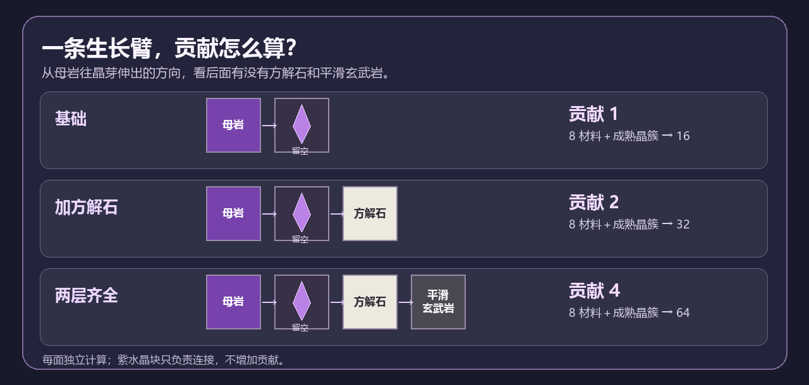
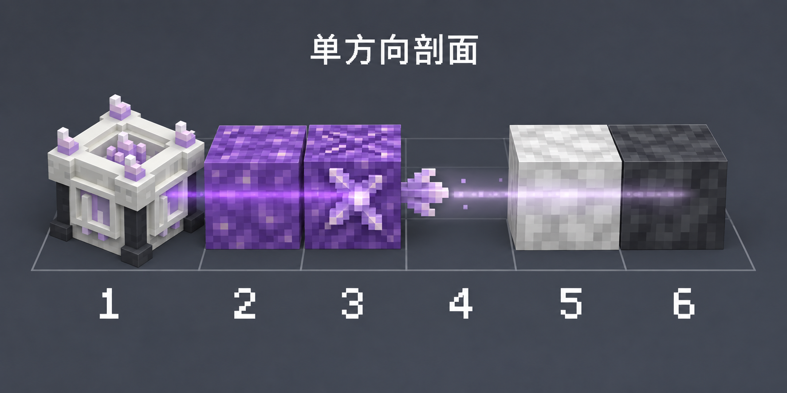
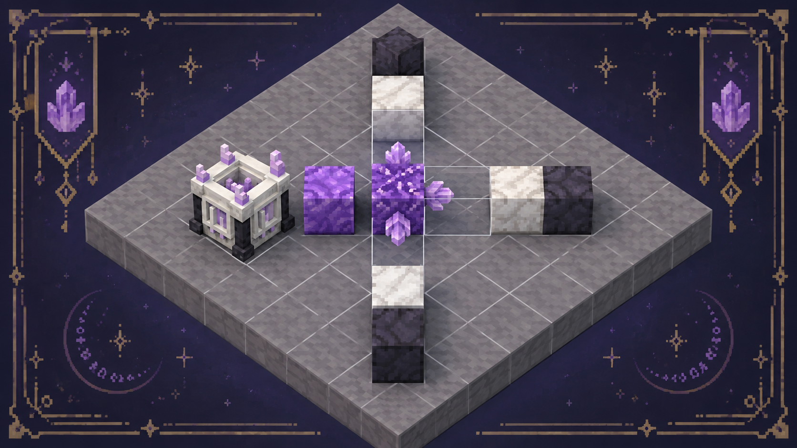
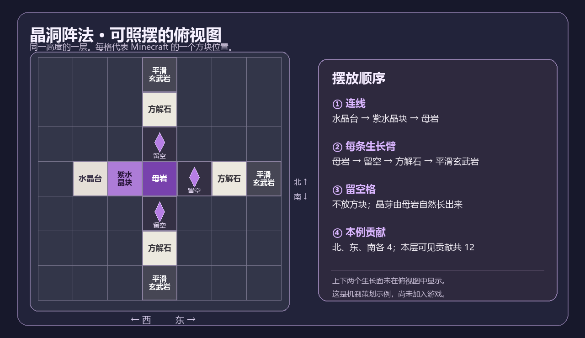

# 母岩增殖台：晶洞阵法与母岩贡献（策划草案）

状态：早期草案，已由[双方块生长势方案](母岩触媒_双方块交互与生长势方案.md)替代；本页图示与数值只作历史方案参考。

## 目标与世界观

幽匿台借生物死亡塑形，母岩增殖台借晶簇生长增殖。玩家围绕工作台搭建晶洞：紫水晶块传导，母岩生长，方解石聚焦，平滑玄武岩收束。原版晶洞正有平滑玄武岩外层、方解石内层及紫水晶内部；母岩会长出晶簇（[Minecraft 晶洞介绍](https://www.minecraft.net/fr-ca/article/amethyst-geode)）。现有 `ADV-015` 已提供从幽匿台取得紫水晶母岩的进阶路径。

阵法没有固定完整蓝图。每个母岩生长面独立计算，玩家可做墙面晶洞、立柱、拱顶或完整洞室；摆对材料次序就有收益。

## 连接与有效生长面

1. 工作台可直接接触紫水晶母岩，或通过面相邻的普通紫水晶块连接母岩。紫水晶块是导体，本身不增加产量。
2. 从工作台起沿导体搜索：建议曼哈顿距离不超过 8、最多 128 个导体节点、最多 8 个母岩。只读已加载区块，不强制加载。
3. 对每个已连接母岩的位置 `p` 和六个方向 `d`，若 `p+d` 是空气、水源、正确附着的小/中/大晶芽或成熟晶簇，则该方向是有效生长面。导体占据的一面不能同时生长。
4. 沿生长面向外检查 `p+2d` 和 `p+3d`：前者放方解石，后者放平滑玄武岩。这给出直观的径向顺序：

   `母岩 → 生长空间/晶芽 → 方解石 → 平滑玄武岩`

## 母岩贡献算法

对每个有效生长面 `f`：

```text
C(f) = 1，当 p+2d 是方解石；否则 0
B(f) = 1，当 C(f)=1 且 p+3d 是平滑玄武岩；否则 0
贡献(f) = 2 ^ (C(f) + B(f))
阵法总贡献 P = 所有归本台母岩的有效生长面贡献之和
```

| 每面的层次 | 贡献 | 首轮测试：消耗 8 个同种材料和 1 个成熟晶簇后产出 |
| --- | ---: | ---: |
| 仅母岩与生长空间 | 1 | 16 个 |
| 外接方解石 | 2 | 32 个 |
| 方解石外再接平滑玄武岩 | 4 | 64 个 |

`P` 用于向玩家说明阵法的预期产能，不再额外乘一次产量。真正的批次产量只取被使用晶簇所在生长面的贡献。母岩数量与有效面数增加可用晶簇的长期供给；层次完善提高每个晶簇的利用率。一个母岩有 4 个有效面，若四面都搭完两层，`P=16`；若四面裸露，`P=4`。数值可调整，但三层判定与贡献规则保持固定。

## 看图摆放：一块母岩的三面阵法



贡献按每个生长面分别计算：没有外层是 1，外侧加方解石变 2，再加平滑玄武岩变 4。图中 16／32／64 的批次产出只是首轮测试值。



剖面从左至右：① 水晶台、② 普通紫水晶块（只负责连接）、③ 紫水晶母岩、④ 留空给晶芽生长、⑤ 方解石、⑥ 平滑玄武岩。④ 是一个方块位置，不要放普通方块；图中的小晶芽表示日后从母岩长入该位置。





精确摆法以俯视格子图为准，所有图示方块在同一 Y 高度。水晶台向东依次接普通紫水晶块和母岩；母岩向北、东、南各伸一条 `留空 → 方解石 → 平滑玄武岩` 的生长臂。普通紫水晶块占据母岩西面，因此西面不算生长面。图中三个水平生长面各贡献 4，合计 12；母岩的上下两面仍按实际摆放另行判定。格子图中的晶体图标只标识预留的空气格，并非需要玩家放置的方块。

## 生产循环

1. 玩家投入白名单内的同种材料，选择“增殖”。必须先获得该材料；不同群系材料的首获仍由现有转换配方负责。
2. 工作台从归属自己的成熟晶簇中选择贡献最高的一面；平局按距离和坐标稳定决定。没有成熟晶簇时等待，不改变原版晶芽生长速度。
3. 输入、输出空间、目标白名单和连接状态全部满足时，在同一服务端操作中扣除材料、放入产物，并把成熟晶簇退回小晶芽。不会掉落紫水晶碎片。输出堵塞则晶簇和材料保持原样。
4. 玩家仍能自己采集晶簇换碎片；那一面暂时无法供工作台使用。这是玩家可见的选择。

初版只增殖可堆叠的普通建材及基础素材。排除母岩、晶簇、矿石、矿物块、金属锭、宝石、装备、带物品数据的容器和特殊奖励；具体白名单逐组审查，避免反向合成套利。

## 多台与界面

- 同一母岩只归一台工作台：按最短导体路径，平局按工作台坐标。避免重叠阵法重复计分或重复消费晶簇。
- 工作台界面显示“已连接母岩数、有效面数、阵法总贡献、成熟晶簇数、下一批预计产量”。点选某个母岩时，可显示六个方向缺少的方解石或平滑玄武岩。
- 在世界中，工作台内核随“无连接／生长中／可生产”作克制的亮度变化；保持现有方块尺寸和像素风格。

## 可行性与验收

现有工程已有有界、仅扫描加载区块的幽匿网络实现，可借鉴服务端搜索、共享归属和 UI 同步方式。新阵法比幽匿网络小：建议 8 格、128 节点、8 母岩；每个母岩最多检查 6 条、每条 3 格。无需监听全部世界声音或新增抽象货币；执行前直接检查晶簇方块状态即可。

需要游戏内验证的点：`p+2d` 为方解石时 `p+d` 晶芽能否按原版完整生长；成熟晶簇退回小晶芽后的后续生长；天然晶洞与人工阵法的产能；一台一母岩到八母岩在默认随机刻速度下的实际每小时产量；区块卸载与两台竞争时的原子结算。优先通过每簇产出量调平衡，保留原版晶簇成长节奏。
