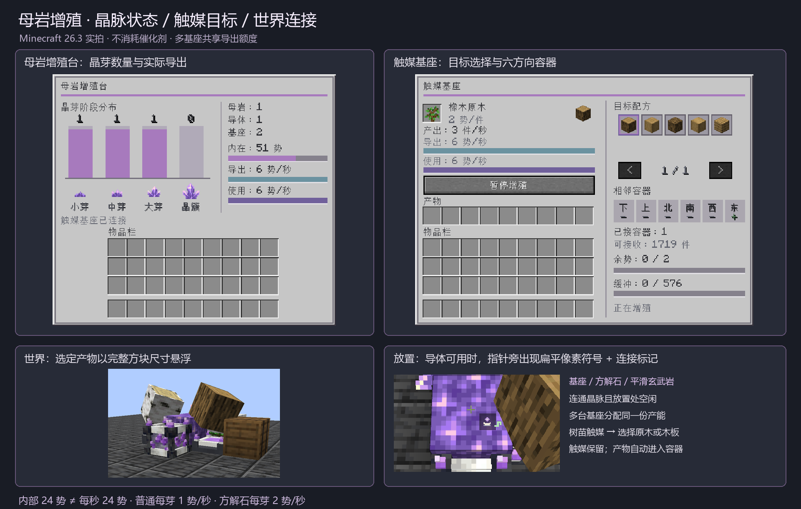

# 母岩增殖台与触媒基座：生长势方案

状态：Minecraft 26.3 / ConvertTable 1.5.1 已实装。**24 是小晶芽的内部生长势，普通连接每芽每秒最多导出 1 点。**



## 方块分工

母岩增殖台锚定晶脉，读取母岩、晶芽和修饰石材，并统筹每秒可用生长势。触媒基座接在这条晶脉的任意紫水晶导体旁，放入一个不会消耗的催化剂，选择目标，再开始增殖。多个基座共享同一晶脉的产能。基座凹槽显示实体催化剂，上方以完整方块尺寸倾斜旋转的是所选产物。

没有新增元素物品、电线或专用多方块框架。首次催化剂仍需要探索、种植或已有转换配方取得。

## 晶脉连接与修饰

- 增殖台六面可接紫水晶块或紫水晶母岩；导体以面相接，母岩也可串接。
- 基座可面贴增殖台、已连接的紫水晶块或母岩；同一晶脉允许多个基座。每秒预算仅提取一次，轮流分配余数，满缓冲或暂停的基座不占用产能。
- 仅扫描已加载区块。相对增殖台曼哈顿半径 8 格，最多 128 个扫描节点（包括增殖台）和 8 块母岩。超过上限或连接两个增殖台时停止生产。基座同时贴着两个不同晶脉时也不能取得双份产能。
- 晶芽必须朝外并正确附着在所计母岩上。空面不供能，仍可按原版方式长出晶芽。
- 方解石／平滑玄武岩可接触母岩，也可接触其连通晶脉中的任意紫水晶导体。导体上的修饰沿该连通组件作用到母岩；直接贴母岩的修饰只作用于该母岩。每种修饰只生效一次，多放不叠加。
- 手持基座、方解石或平滑玄武岩，瞄准可用晶脉中能放置的导体表面，指针旁出现扁平像素符号与连接标记（基座为晶体托台、方解石为双导出箭头、平滑玄武岩为向上生长箭头）。断开的导体、堵住的放置位置及冲突／超限晶脉不显示有效提示。

```text
[母岩增殖台]─[紫水晶块]─[母岩]─向外的小晶芽
                   │       │
              [触媒基座]  方解石
                   │
                [木桶]
```

晶芽前方需要留空气或水，修饰石材和基座使用其他面。

## 数量与生长

| 晶芽阶段 | 内部势 P₀ | 平滑玄武岩后的 P | 普通导出上限 | 方解石后的导出上限 |
| --- | ---: | ---: | ---: | ---: |
| 小晶芽 | 24 | 25 | 1/秒 | 2/秒 |
| 中晶芽 | 16 | 17 | 1/秒 | 2/秒 |
| 大晶芽 | 8 | 9 | 1/秒 | 2/秒 |
| 成熟晶簇 | 0 | 0 | 0 | 0 |

每芽可导出量 `E = min(P, 上限)`。全部有效晶芽的 E 相加，形成整个晶脉每秒的公共预算。基座吸收点数后加上保存的余势，按所选配方的单件费用结算。未凑够一件的余势保存；满缓冲不吸收点数；点数不会因为多放基座而复制。

例子：一颗受方解石影响的小晶芽导出 2 势/秒。单基座选橡木原木（2 势/件）时每秒产一块，选橡木木板（1 势/件）时每秒产两块。两台原木基座分配到各 1 势/秒，分别每两秒产一块。

上一轮实际吸收的点数按各芽可导出量分配为 S，原版晶芽生长事件成功概率乘以：

```text
clamp((P - S) / P₀ × (接触方解石 ? 0.8 : 1), 0.15, 1)
```

方解石即使空闲也减慢生长；平滑玄武岩增加内部剩余势，不突破导出上限。基座开始且输出有空间时，成熟晶簇可重新播为小晶芽；暂停时保留晶簇供采集。没有额外晶体掉落。

## 催化剂与选择

目录含 **53 种催化剂、225 个目标**。橡树树苗只开放橡木一组，桦树树苗开放桦木一组；石材样本、土质材料与染料开放各自相关建材。触媒不消耗，带自定义组件的物品不能参与。没有矿石、钻石、锭、装备及高价值战利品默认量产。详见 [触媒配方设计](触媒增殖配方设计.md)。

- 放入一个催化剂。只有一个目标时自动选中；多目标时先选目标。
- 右侧图标列表可翻页，显示产物名称与每件费用。选择后启停按钮生效。
- 点击开始可连续生产，关闭界面也继续。切换目标或更换／取出催化剂会暂停并清空未成品余势；已经生产的物品保留。
- 同一目标重复点击不会暂停。无效索引或未持有对应催化剂的目标不能在服务器执行。

## 界面与批量输出

母岩台：四阶段晶芽数量柱图；母岩、导体、基座数量；内部势、每秒导出上限与上一轮全部基座实际吸收。内部势单位为“势”，流量为“势/秒”，分别使用对应刻度。

触媒基座：实体触媒、所选目标、每件费用、最近一轮件数、晶脉导出与本机吸收条、余势／单件费用、九格输出占用和六方向容器状态。真实余额条不会模拟固定时长生产进度。

| 操作 | 结果 |
| --- | --- |
| 手持催化剂右击空基座 | 放入一件催化剂，不自动开机。 |
| 右击基座 | 选择目标、启停、取产物或替换触媒。 |
| Shift 点击背包催化剂 | 放入空触媒槽；每槽保留一件。 |
| Shift 点击产物 | 整格移动到背包。 |
| 基座相邻六面放容器 | 每 5 游戏刻自动导出；双箱按一个容器计。 |
| 顶部漏斗 | 可放入一件催化剂；其他面可抽取产物。 |

绿色 `+` 表示该方向容器可接收目标，黄色 `!` 表示存在容器但已满／不能接收／被锁定，灰色 `-` 表示没有相连容器。统计遵守容器自己的面向插入规则；未生成战利品的容器不打开。九格缓存通常可存 576 件，切换目标后允许旧产物继续导出。破坏基座按原版容器规则掉落触媒与产物。

## 实现与验证

服务器每秒扫描有界晶脉并分配一次总预算；客户端放置提示缓存 5 刻，扫描不会加载区块。菜单数据由服务器同步，目标 ID、运行状态、余势、产量和库存持久化。

`-PgrowthTest runClientGameTest` 在隔离世界验证真实增殖、普通／方解石 1/2 导出、玄武岩内部势、多基座守恒、非消耗催化剂、目标选择数据包、存档、容器可接收／堵塞状态和放置提示，并拍摄实际界面。`build` 使用 Minecraft 26.3 的实际模型解析器验证十个运行时模型。
